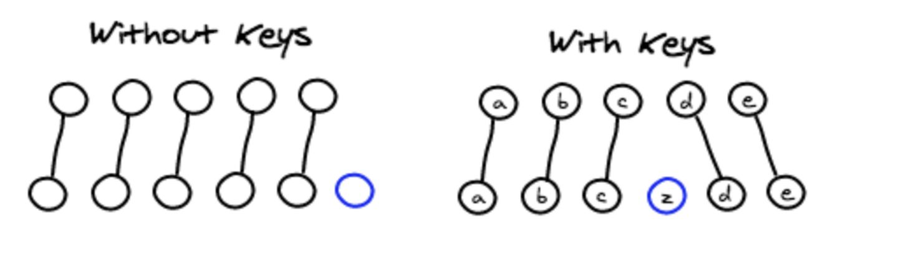
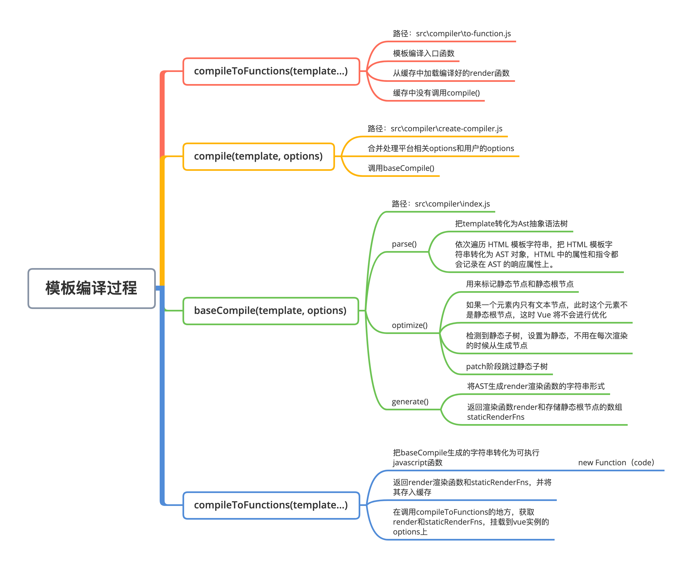

## Vue.js 源码剖析-响应式原理、虚拟 DOM、模板编译和组件化

### 简答题

#### 1、请简述 Vue 首次渲染的过程。

初始化与首次渲染逻辑图：

#### 2、请简述 Vue 响应式原理。

大体上可分为**初始化**和**更新**两个步骤。

**初始化视图**

在 Dom 挂载视图首次渲染之前，实例初始化的时候`initState()`方法将 data 选项中的数据绑定到 vue 实例上，然后通过`Observer`转化成响应式数据。然后执行`vm.$mount()`；新建一个渲染`Watcher`，执行依次执行`updateComponent` --> `_update` --> `__patch__`方法渲染视图；在此过程中访问属性触发属性的`getter`方法，调用`dep.addSub`收集`Watcher`依赖。

**更新视图**

选项 data 中的属性发生变化，触发属性的`setter`方法，发送通知`dep.notify()`，该属性所有依赖`Watcher`实例`update`执行，渲染`watcher`直接执行`queueWatcher`,把当前`watcher`放进一个队列; 调用`nextTick`刷新队列，异步更新视图，然后依次执行`updateComponent` --> `_update` --> `__patch__`,视图**更新**

#### 3、请简述虚拟 DOM 中 Key 的作用和好处。

> 为了给 Vue 一个提示，以便它能跟踪每个节点的身份，从而重用和重新排序现有元素，你需要为每项提供一个唯一 key attribute.

以上是 Vue 文档中对 key 的作用的解释，理解了虚拟 Dom 和 diff 算法如何排序的我们会更深刻理解这句话。

在列表中通过三种节点操作新旧节点进行更新：插入，移动和删除，在没有 key 值的列表 diff 中，只能通过按顺序进行每个元素的对比，更新，插入与删除，在数据量较大的情况下，diff 效率低下；用户设置 key 属性的方式调整 diff 更新中默认的排序方式，就能够快速识别新旧列表之间的变化内容，提升 diff 效率。

在 `updateChildren` 函数中，调用 `patchVnode` 之前，会首先调用 `sameVnode()`判断当前的新老 VNode 是否是相同节点，`sameVnode()` 中会首先判断 key 是否相同。如果没有传递 key,才会 tag 相同也会被判断为相同节点，在列表中大多数都是相同 tag 的子节点，根据 diff 算法，会依次从开始和结尾遍历新老节点，会得到节点都相同的结果，然后 `patchVnode` 对比两个节点，当子节点顺序发生变化的时候，会增加产生大量的 Dom 操作。如果传递 key 在遍历新老节点的时候，加入子节点的顺序发生变化，由于 key 值不同，在对比首末节点的时候会判断为不同节点，然后根据 key 值去找对应的新老节点，如果子节点没有发生改变则不做任何操作，从而减少 Dom 操作的数量。

#### 4、请简述 Vue 中模板编译的过程。

在完整带编译器的版本的 Vue，入口文件调用传入用户编写的 template 模板`compileToFunctions`函数,获取到渲染函数`render`和和存储静态根节点代码的数组`staticRenderFns`,并将其挂载到 Vue 实例的 options 上。

模板 template 编译成渲染函数主要分为三个步骤

1. 把模板转化为抽象语法树
   - 依次遍历 HTML 模板字符串，把 HTML 模板字符串转化为 AST 对象，HTML 中的属性和指令都会记录在 AST 的响应属性上。
2. 优化抽象语法树
   - 标记静态节点和静态根节点
   - 如果一个元素内只有文本节点，此时这个元素不是静态根节点，这时 Vue 将不会进行优化
   - 检测到静态子树，设置为静态，不用在每次渲染的时候从生成节点
   - patch 阶段跳过静态子树
3. 把抽象语法树生成字符串形式的 js 代码
   - 将 AST 生成 render 渲染函数的字符串形式
   - 使用`new Function`字符串转化为可执行 javascript 函数

